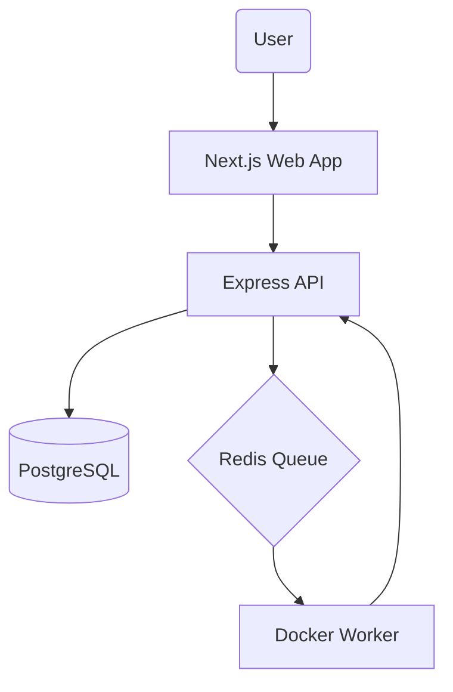

# RunRight 🚀

RunRight is a high-performance, secure, and real-time coding platform (LeetCode Clone). It features an isolated code execution engine powered by Docker and a modern Next.js dashboard.

## 🏗️ Architecture

RunRight is built as a **TypeScript Monorepo**:

- **`apps/api`**: The core backend controller (Auth, Problems, Submissions).
- **`apps/worker`**: The execution engine. Polls Redis and runs code in Docker.
- **`apps/web`**: Premium Next.js frontend with Monaco Editor.
- **`packages/common`**: Shared Prisma models, types, and logic.



## 🛠️ Security Hardening

- **Air-Gapped Sandbox**: Code runs with `--network none`.
- **Read-Only FS**: Entire OS is read-only, with only `/tmp` writable.
- **Resource Limits**: Hard caps on CPU, Memory, and PIDs.
- **Safety Kill-switch**: 15s absolute timeout for all executions.

## 🏃 Quick Start

1. **Install Dependencies**:
   ```bash
   npm install
   ```

2. **Setup Database**:
   ```bash
   npm run db:migrate
   ```

3. **Start Development Environment**:
   You can start services individually:
   - `npm run dev:api`
   - `npm run dev:worker`
   - `npm run dev:web`

## 📦 Building for Production

To build the entire monorepo at once:
```bash
npm run build
```

## ⚖️ License
MIT
